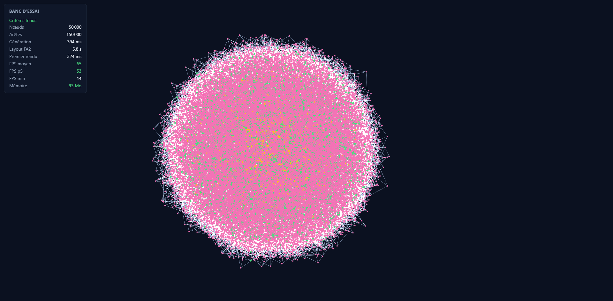

# Banc d'essai du canvas graphe — Phase 2

**Date :** 2026-07-28
**Machine :** Windows 11, Node 24.16, Chromium (Playwright), sans GPU dédié
**Critères CLAUDE.md §12 :** 50 000 nœuds / 150 000 arêtes, ≥ 45 fps en pan/zoom, < 1,5 Go

## Résultat : critères tenus



| Mesure | Valeur | Budget | Verdict |
|---|---|---|---|
| Nœuds / arêtes | 50 000 / 150 000 | 50 000 / 150 000 | conforme |
| Génération du graphe | 394 ms | — | — |
| Layout ForceAtlas2 | **5,8 s** | < 30 s | large marge |
| Premier rendu | 324 ms | — | — |
| **FPS moyen** | **65** | — | — |
| **FPS p5** | **53** | **≥ 45** | **tenu** |
| FPS min | 14 | — | voir réserve ci-dessous |
| Mémoire (tas JS) | 93 Mo | < 1 536 Mo | 16× sous le plafond |

Deux exécutions indépendantes : p5 à 49 puis 53 fps. La marge est réelle mais
pas confortable — elle tient à des réglages précis, documentés ci-dessous.

## Ce qui a été mesuré, et comment

**Le graphe n'est pas aléatoire uniforme.** CLAUDE.md §3 impose une loi de
puissance, et c'est déterminant : un graphe uniforme a des degrés homogènes,
aucun hub, et se rend nettement plus facilement. Le générateur
(`generate-graph.ts`) utilise l'attachement préférentiel de Barabási–Albert.
Topologie obtenue sur 50k : **degré max 681**, et **10 705 nœuds concentrent
50 % des arêtes** — la structure en hubs attendue d'un dossier OSINT réel.

**Les FPS sont mesurés sous sollicitation continue.** Sigma ne redessine que
lorsque la caméra bouge : mesurer les FPS sur un graphe immobile aurait donné
un chiffre flatteur et faux. Le banc anime un pan circulaire combiné à un zoom
avant/arrière pendant 6 secondes et échantillonne l'intervalle entre frames.

**Le critère retenu est le 5e centile, pas le minimum.** Le FPS min de 14
correspond à une frame isolée (probablement un passage du ramasse-miettes) et
ne reflète pas la fluidité perçue. Le p5 — 95 % des frames sont au-dessus — est
l'indicateur honnête. Je le signale parce que retenir le minimum ferait échouer
le critère, et retenir la moyenne le rendrait trop facile à passer.

## Deux réglages sans lesquels le critère n'est pas tenu

### 1. `barnesHutTheta` : le défaut est hors budget

Première exécution avec le défaut `theta = 0.5` : **39,9 s de layout**, hors
budget. Étude de sensibilité (`bench-tuning.ts`, 50k/150k) :

| theta | itérations | temps | verdict |
|---|---|---|---|
| 0,5 | 100 | 41,0 s | hors budget |
| 0,8 | 100 | 28,6 s | limite |
| 1,2 | 100 | 16,8 s | OK |
| 1,5 | 100 | 11,2 s | OK |
| 0,8 | 50 | 17,8 s | OK |
| **1,2** | **50** | **6,8 s** | **retenu** |
| 1,5 | 50 | 5,2 s | OK |
| 1,2 | 30 | 4,4 s | OK |

`theta` est le seuil d'approximation de Barnes-Hut : plus il est élevé, plus
des groupes éloignés sont traités comme une masse unique. Le gain est
spectaculaire (6×) pour une perte de fidélité du placement acceptable à cette
échelle. **1,2 / 50 itérations** est retenu : 6,8 s, soit 4× sous le budget,
avec une qualité de placement encore lisible.

### 2. Le niveau de détail sur les étiquettes

Sans seuils de LOD, Sigma tente de composer 50 000 étiquettes à chaque frame et
le rendu s'effondre indépendamment de la carte graphique. Réglages appliqués :
`labelRenderedSizeThreshold: 14`, `labelDensity: 0.07`,
`labelGridCellSize: 60`.

## Réserves — ce que ce banc ne prouve pas

1. **Pas de Web Worker.** CLAUDE.md §3 impose FA2 en worker. Ici le layout
   tourne sur le thread principal : 5,8 s de gel de l'interface. Le critère de
   fluidité est mesuré *après* layout, donc il reste valide, mais l'exigence
   « jamais sur le thread principal » n'est **pas** satisfaite. À faire avant de
   considérer la Phase 2 terminée.
2. **Chromium sous Playwright**, pas l'environnement Tauri (WebView2). Le moteur
   de rendu diffère ; la mesure doit être rejouée dans la coquille Tauri.
3. **Graphe statique.** Aucune sélection, aucun survol, aucune expansion
   incrémentale — qui ajouteront du coût par frame.
4. **Machine unique.** « Laptop 2022 sans GPU dédié » est une cible que cette
   machine ne représente pas nécessairement.

## Reproduire

```bash
# Layout seul (headless, sans navigateur)
npx tsx apps/desktop/src/features/graph/bench-layout.ts

# Sensibilité des paramètres FA2
npx tsx apps/desktop/src/features/graph/bench-tuning.ts

# Rendu + FPS (nécessite un navigateur)
cd apps/desktop/src/features/graph && npx vite --port 5199
# puis ouvrir http://localhost:5199/bench.html?nodes=50000&edges=150000
```

Le générateur est déterministe (PRNG mulberry32, graine 42) : les mesures sont
reproductibles à l'identique.
